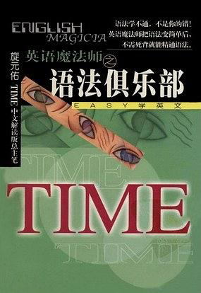

# 《语法俱乐部》&《旋元佑进阶文法》 - [在线阅读](https://tskysheep.github.io/english-grammar-book/)

  
  

### 作者简介

**旋元佑**，TIME 中文解读版《解读时代杂志》总主笔。第一名考上台大外文研究所，分数几乎是第二名的 2 倍。

旋元佑老师在台湾完成所有教育，从未出洋留学，但凭借对外国语文独特的学习方法，创下托福满分（677 分）及 GRE 字汇部分（720 分）世界纪录的惊人成就。

旋老师投入英语教学多年，深入了解中文读者学习英语的困难。为了帮助华人英文学习者学好英文，特别设计出一系列《深入浅出》、《只要理解，不要公式》的教学单元，如《语法俱乐部》、《时代经典用字》、《字源大挪移》、《修辞高峰会》等，在《解读时代杂志》连载，与读者分享他的学习方法及心得。

### 项目说明

本项目整理了旋元佑老师的两部英语语法著作：

- **《语法俱乐部》**（第一版）— 22 章，涵盖初级到高级句型
- **《旋元佑进阶文法》**（第三版）— 25 章，是第一版的超集，内容更加详尽丰富

本电子版使用 [VuePress](https://vuepress.vuejs.org/zh/) 构建，在原有内容基础上做了以下改进：

- 新增页面右侧章节标题导航，支持到 h6 层级，便于快速定位
- 对句子成分（S / V / O / C）采用统一的组件标注方式，阅读体验更佳
- 将台湾地区专有术语替换为大陆通用术语（如「片语→短语」「子句→从句」等）

如发现内容错误，欢迎在 [issues](https://github.com/Tskysheep/english-grammar-book/issues) 中提出。

### 致谢

本项目基于以下两个开源项目整理而成，感谢原作者的贡献：

- [grammar-club](https://github.com/llwslc/grammar-club) — 《语法俱乐部》电子化
- [EnglishGrammarBook](https://github.com/codeyu/EnglishGrammarBook) — 《旋元佑进阶文法》电子化

### 免责声明

本项目仅供个人学习与交流使用，不得用于任何商业用途。书籍内容版权归原作者旋元佑老师及相关出版社所有。如原作者或版权方认为本项目侵犯了您的合法权益，请通过 [issues](https://github.com/Tskysheep/english-grammar-book/issues) 联系，我们将在第一时间予以删除。
